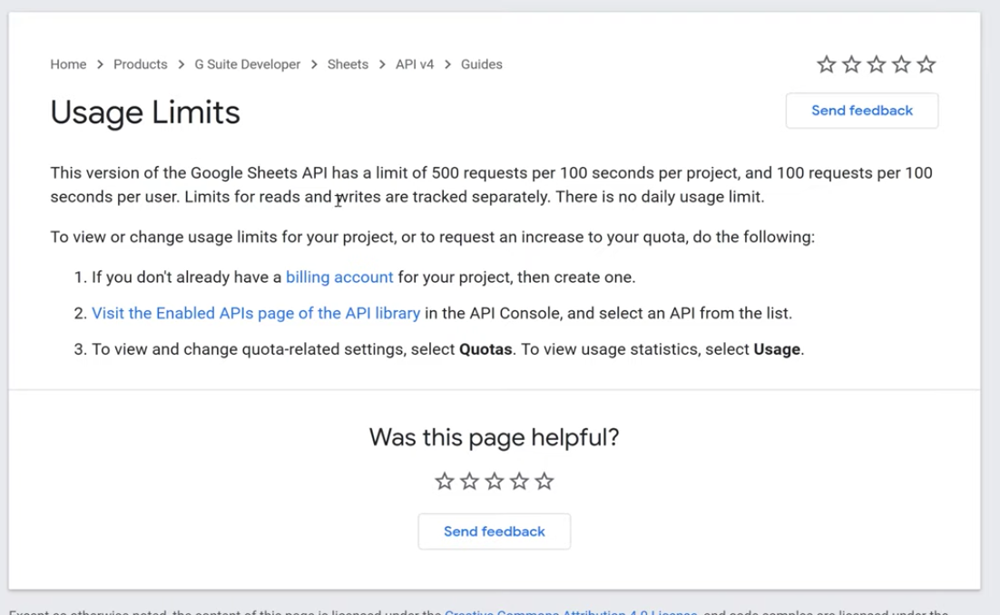
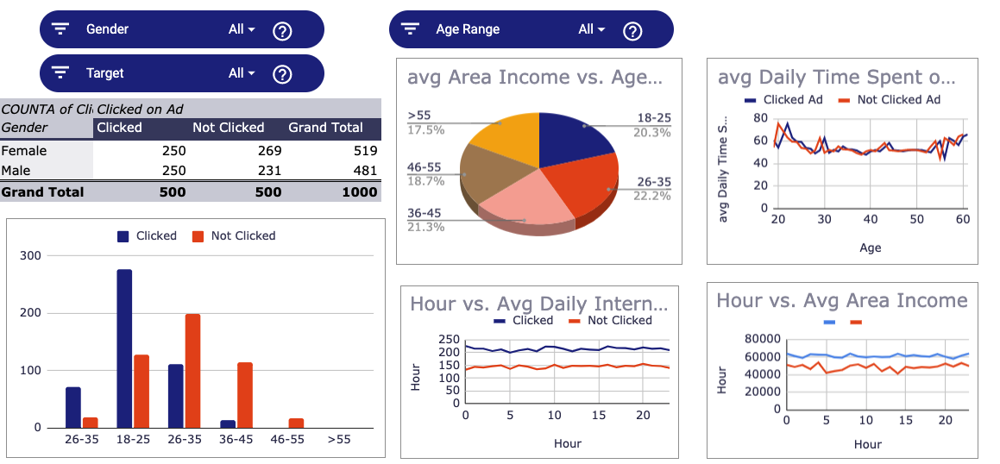

# **Google Sheet API And Python**
 
## Introduction
Microsoft released the first version of Excel for the Macintosh on September 30, 1985. After that Google released the Google Sheet which has the same functions as MS Excel. Most companies and their data analysts get used to using Excel or Google Sheet to manipulate and analyze the data. Almost every data analyst use Excel or Google Sheet every day. For me, Excel or Google Sheet is good for storing the data but not comfortable to clean, mine, and visualize the data.
If you are the same as me, there is a way to connect Google Sheet and Python using API. Then we can extract the data from Google Sheet and upload the updated data to the same Google Sheet but a new sheet.  
There are several steps to connect Google Sheet and Python.

## Necessary pre-work that we need to do
First of all, you need an account to log in Google developer console and create a new project. You can name it as anything you want. Then you need to click the "Library" on the left side and search "Google Drive API" then select it and enable it. After that, we need to go back to click the "Library" again and search "Google Sheet API". After you enable it you need to click "Credential" on the left side to create credentials for a Web Server to access Application Data then name the service account and grant it a Project Role of Editor. Then we can download the JSON file to the desired location and rename it as "creds.json".

Don't worry. For the first time, you may feel very confused. Here is the video tutorial to all the steps in the pre-work part.

For obtain your own creds.json, please [watch this video](https://www.youtube.com/watch?v=cnPlKLEGR7E&t=428s)

## Python Code 
- Install/import libraries
- Function for obtaining client_email
  There is one information from the "creds.json" that is very important - client_email. For example, we have a google sheet which contains all the data that we need to analyze, and if we want to share it, we normally use email to share the Google sheet file. Here we can just simply copy can paste your client_email, and share your Google Sheet with this email.
- Create a function to extract data from a specific Google Sheet
- Create a function to upload an updated data to your Google Sheets on a new sheet
- Get client_email and Extract data from a Google Sheet
-  Create your own data as new_data
-  Upload this new_data to a specific sheet of the Google Sheet file
 
For more code details please visit the jupyter notebook above.
 "Google_Sheet_API_with_Python.ipynb" contains all the steps you need to do for data extraction and uploadation. For future usage you can just simply use the functions from "GS_and_Python.ipynb".  
## Conclusion
For me, it is easier to visualize the data using python because I can flexibly manipulate the data with Python. If you are not very familiar with some functions of Google Sheet, you can just manipulate the desired data using Python, then upload those datasets to the same google sheet file in different sheets. The reason why I want to do this because some companies require you to create a dashboard and sometimes it is very time-consuming to create some pivot tables or any tables using query/sumifs or other functions in Google Sheet. So we can just directly use the datasets that we uploaded to easily create a dashboard with Tableau or Google Data Studio.
# Google_Sheet_Api_with_Python
